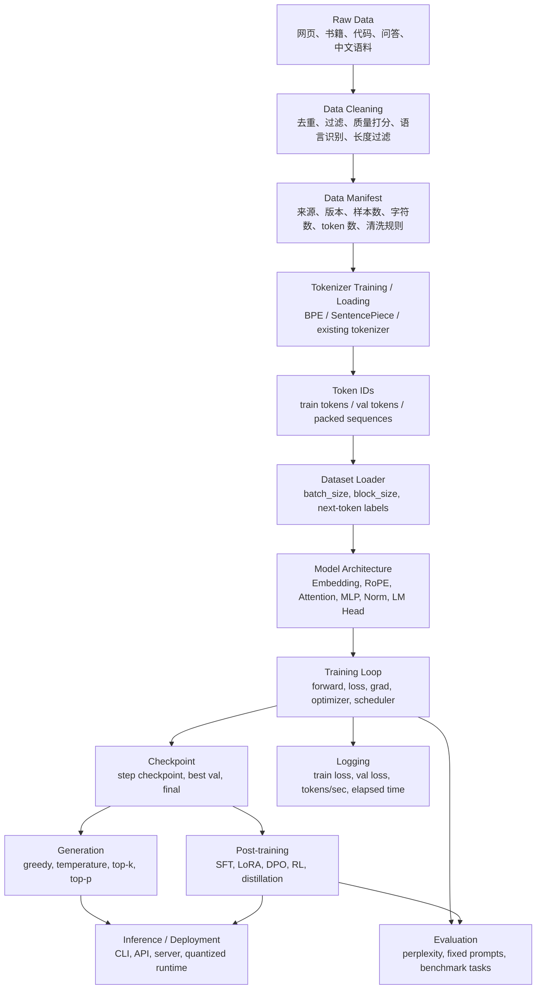

# LLM 训练工程技术地图

下面这张图把真实 LLM 训练项目的主要层次串起来。我们的本地 MLX GPT Lab 后续也应该按这个方向拆分。



## 对应到我们的课程

| 工程层 | 已完成课程 | 下一步需要补强 |
|---|---|---|
| raw data / cleaning | 20, 23 | 更稳定的数据 manifest 和质量报告 |
| tokenizer | 21, 22 | tokenizer 版本管理和真实模型 tokenizer 对齐 |
| token ids / dataset loader | 19, 22, 23 | 统一 batch API，支持不同数据集 |
| model architecture | 15, 17, 25 | baseline / modern 统一接口 |
| training loop | 15, 18, 19, 23, 24 | 配置化、checkpoint 恢复、日志标准化 |
| checkpoint | 18, 23 | 标准 checkpoint metadata |
| evaluation | 初步缺失 | 建立 `evals/` |
| generation | 16, 22, 23 | 统一 sampling API |
| inference / deployment | 尚未正式进入 | MLX-LM 阶段 |
| post-training | 尚未进入 | SFT / LoRA / preference 后续课程 |

## 一句话总结

真实 LLM 工程不是只有模型结构。它是一条链：

```text
数据可追溯 -> tokenizer 稳定 -> batch 正确 -> 模型可训练 -> checkpoint 可恢复 -> eval 可比较 -> 推理可部署 -> 后训练可扩展
```
